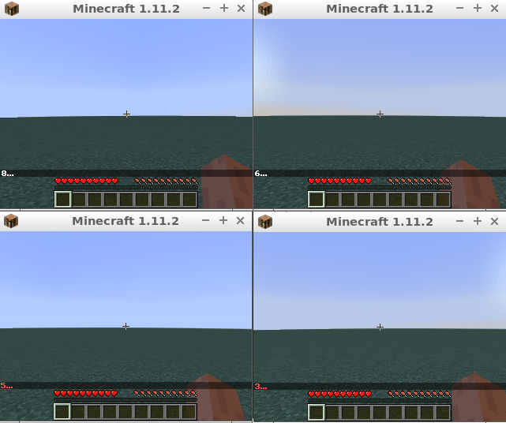

# Malmo Example Agent

This is a c++ example agent extracted from main repository of Project Malmo.



## Requirement

- Malmo static library 0.37.0
  - This repository doesn't containing the library, please put the lib to `malmo/lib/libMalmo.a`.

## Build

```bash
mkdir build
cd build
cmake ..
make
```

## Run Agent

```bash
export MALMO_XSD_PATH=../Schemas && ./run_mission
```